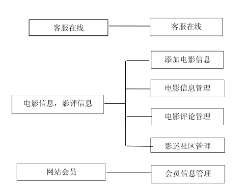
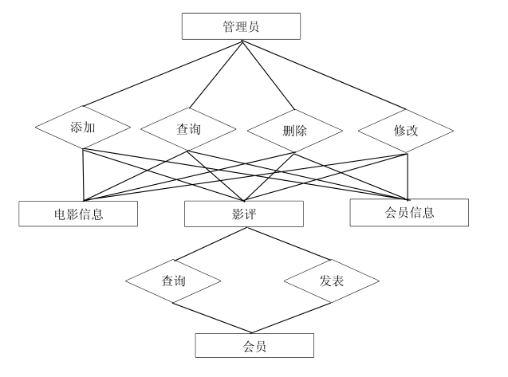
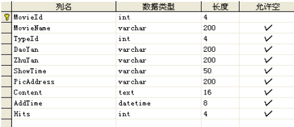
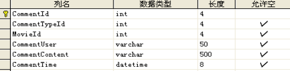
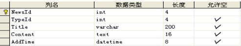
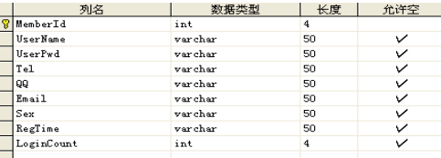
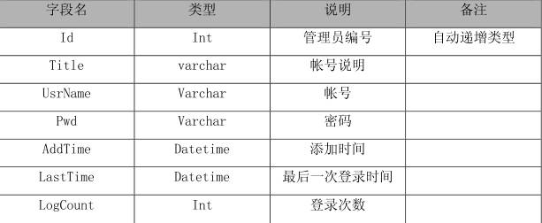
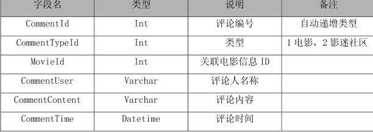
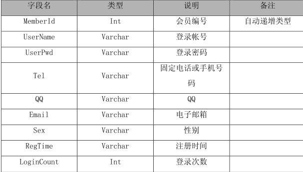
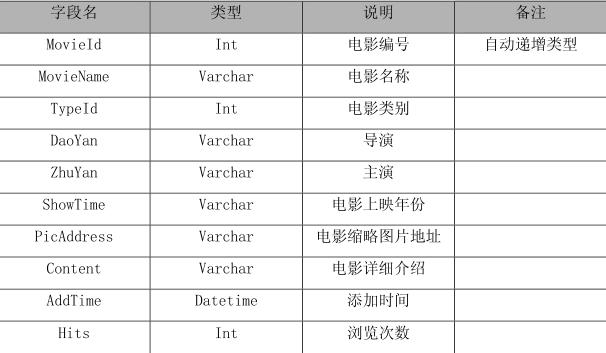

# 1 系统需求分析

## 1.1可行性分析

要成功地实现一个项目，首先应该进行功能上的需求分析，这样才能令设计出的项目满足用户的各项功能需求。可行性分析也称为可行性研究，是在项目调查的基础上，针对新项目的开发是否具备必要性和可能性，对新项目的开发从技术、经济、社会的方面进行分析和研究，以避免投资失误，保证新项目的开发成功。

市场可行性:市场的可行性是项目完成后是否能够在实际中很好的推广。本项目提升了观影感受，拉近了电影和观影人的距离，操作简单、方便。

技术可行性:技术上的可行性分析主要分析技术条件能否顺利完成开发工作，硬、软件能否满足开发者的需要等。该项目采用了Browser/Server模式进行开发。.Browser/Server体系结构紧密的结合了Internet/ Intranet技术，是技术发展的大势所趋，它把网站带入了一个崭新的发展时代。数据库服务器SQL数据库，它能够处理大量数据，同时保持数据的完整性并提供许多高级管理功能。它的灵活性、安全性和易用性为数据库编程提供了良好的条件。因此，项目的开发平台已成熟可行。

## 1.2项目要解决的问题

首先，因为该项目是面向广大电影爱好者的，包括学校和社会上的各个阶层的人士，所以在页面设计和布局上一定要贴近群众，符合大众的浏览习惯。其次就是项目的压力测试，因为项目面对人员较广，具有不确定性和不稳定性，故要考虑到流里急剧增大对此项目造成的打开页面变慢等诸多问题。

## 1.3项目目标

我们的系统旨在通过网络爬虫爬取豆瓣电影的电影评分，关键字，类别，电影影评以及影评点赞数等信息，向用户提供其所查询的电影的全面信息，并根据用户的偏好按照电影类别以及关键词向用户推送相关电影热门影评资讯。

# 2 功能设计

## 2.1功能划分

该电影数据分析项目包含以下三个功能模块：

1.电影信息查询

2.用户偏好推荐

3.用户登录功能

## 2.2功能描述

项目将用户喜好的电影类型与豆瓣影评系统结合，满足用户的需求。

### 2.2.1电影信息查询

用户通过查询电影名称后向用户展示电影的评分关键字与影评以及影评热度等信息。

### 2.2.2用户偏好推荐

用户注册后进入个人定制页界面，选择偏好影片类型与关键词。系统根据用户偏好在首页向用户推荐相关电影资讯影评等。

### 2.2.3用户登录功能

用户通过输入注册的账号密码进行登入操作或通过手机验证码登入系统，完成对目标电影评论信息的查询。

## 2.3功能设计

### 2.3.1用例图

该系统的后台用例图如下：

### 2.3.2 E-R图

实体与属性之间的关联
E-R模型的组成元素有:实体、属性、联系。E-R模型用E-R图表示。实体是用户工作环境中所涉及的事务，属性是对实体特征的描述，(1)模型中的实体相当于实体集、一个表，而不是单个实体或表中的一-行。实体用矩形
框表示，实体名称标注在矩形框内。用菱形表示实体间的联系，菱形框内写上联系
名，用无向边把菱形分别与有关实体相连接，在无向边旁标上联系的类型。
(2)属性是实体的性质。用椭圆框表示，与实体之间用一条线相连表的主码是关键属
性，关键属性项加下划线。
(3)项目各子模块中主键相同的字段之间存在着相互关联的关系。

数据库逻辑设计E-R图如下：

# 3 详细设计

## 3.1后台设计

电影信息管理

此模块存储本站海量电影资源数据，属性包括:电影名称、导演
、主演、上映年份、电影类型、详细介绍、添加日期 等，表结构如图：

影评

将从豆瓣爬取的该电影优质评论的评论ID，电影类型，评论时间，点赞数浏览量等信息展示，表结构如图：

客服在线

如您对本电影评价系统有任何疑问或者意见及建议，都可在我们的客服在线板块中进行客服在线交流：

会员管理

成为会员后您的信息将会在我们的数据库中进行储存，在后续修改个人信息时也十分方便：

## 3.2前台设计

电影信息管理:此模块存储本站海量电影资源数据，属性包括:电影名称、导演、主演、.上映年份、 电影类型、详细介绍、浏览量等;

影迷社区管理:此模块是对评论功能的一个扩展，让广大电影爱好者能够更广泛的表达自己的内心，畅谈自己的感悟，以及相互之间的沟通、了解和交流。

会员管理:本网站允许会员注册，会员注册后的信息会保存在数据库表中，会员通过前台登录也可方便、快捷的修改注册时所填写的信息。

客服在线:若您对本站有任何问题或好的建议，都可通过此模块来进行反馈或与管理员进行沟通，让网友和本站真正实现交互。

站内搜索：强大的站内搜索引擎，除了给您推荐的电影，您可以搜索任何您喜欢的电影。

# 4 数据操作及表格设计

## 4.1数据操作

进行数据库设计时，网站设计了一些基础的表格，供用户在基本操作中，快捷方便的使用。如:已经定义了一个数据库的信息，如果在另一个数据库中也将使用这些信息，在定义数据库字段内容时，不需要重复输入这些信息，而是采用调用已经定义好的数据库信息的模式，直接存储关联字段。
在访问数据库时，采用公用数据模块存放访问数据库需要的对象。该模块在各个功能模块中被直接调用，连接始终保持，并不是即时连接，这样，避免对数据库的反复连接，并减少代码编写，从而提高项目开发效率。

## 4.2表格设计

后台管理员表，字段包括Id (管理员编号)，Title (帐号说明)，UserName (帐号)，Pwd (密码)，AddTime (添加时间)，LastTime (最后- -次登录时间)等，如图：

评论表，字段包括ConmentId (评论编号)，CommentTypeId (类型)，MovieId (电影的ID)，CommentUser (评论人)CommentContent (评论内容)，CommentT ime
(评论时间)等，如表所示。

会员表，字段包括MemberId (会员编号)，UserName (登录帐号)，Userpwd (登录密码)，LoginCount (登录次数)，Tel (固定电话或座机号码)，QQ，Email (电子邮箱)，Sex (性别)，RegTime (注册时间)等，如表所示。

电影信息表，字段包括MovieId (电影编号)，MovieName (电影名称)，TypeId(电影类型)，DaoYan (导演)，ZhuYan (主演)，ShowTime (电影.上映年份)，PicAddress (电影缩略图片地址)，Content (电影详细介绍)，Hits (浏览次数)等，如表所示：

# 5 开发环境

## 5.1开发工具

我们知道数据库以共强大的操作和管理功能成为高速信息表达的途经。据我所知，数据库的类型有很多，然而本项目选择了用SQL Server2005来作为数据库软件。

关于SQL Server2005 的介绍: Microsoft SQL Server 2005 是一个全面的数据库平台，使用集成的商业智能(BI) 工具提供了企业级的数据管理。Microsoft SQL Server2005数据库引擎为关系型数据和结构化数据提供了更安全可靠的存储功能，使您可以构建和管理用于业务的高可用和高性能的数据应用程序。

用它作为数据库的理由为: Server2005能够满足今天的商业环境要来不同类型的数据库解决方案，包含了非需丰富的新特性:通过提供一个更安全、 可靠和高效的数据管理平台，增强企业组织中用户的管理能力，大幅提开I管理效井降低运维风险和成本:通过提供先进的商业智能平台满定众多客户对业务的实时统计分析、监控预测等多种复杂管理需求，推动企业管理信息化建设制业务发展。同时，SQL Server2005将提供一个极具扩展性和灵话性的开发平台，不断拓展您的应用空间，实观数据业务互联.为您带来新的商业应用机遇。由于大减少了应用程序宕机时间，提高了系统的可伸输性和性能，井加以更严格的安全控制。SQL Server2005在支持现实中最苛制的企业级系统要求的道路上，迈出了极大的一步。SQL Server2005 是微软服务器家族中重要的一部分， 通过微软服务器系列声F有的SQL Server2005所实现的增强的管理性和集成性，客户可以有效降降低总体拥有成本并从更快的开发部署时间中受益。

## 5.2结构：三层架构

网站结构分为三个逻辑层:

web层：它为客户端提供对应用程序的访间，它由ASP.NET Web窗体和代码隐藏文件组成。

业务理辑层：业务逻辑层主要负责对数据层的操作。也就是说把-一些数据层的操作进行组合. .可以通过编程来实现对数据库的访间，最终得到想要的结果。

数据访问层：数据访问层主要是对原始数据(数据库或者文本文件等存放数据的形式)的操作层，具体为业务逻辑层或表示层提供数据服务。

# 
